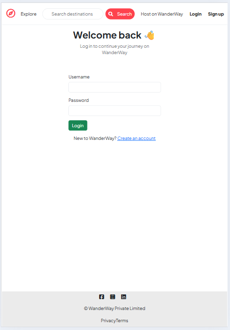
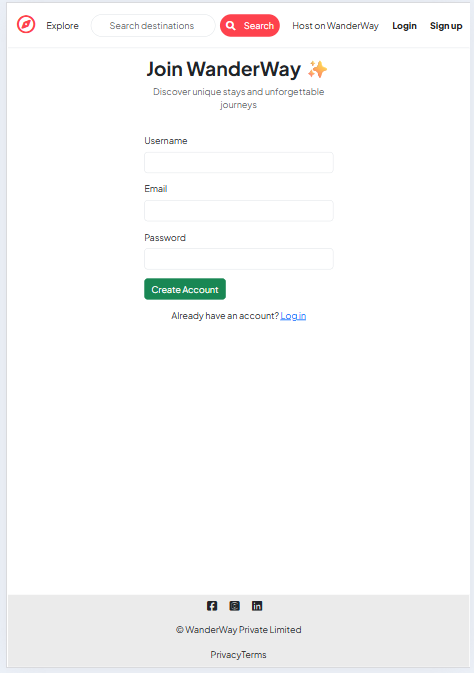
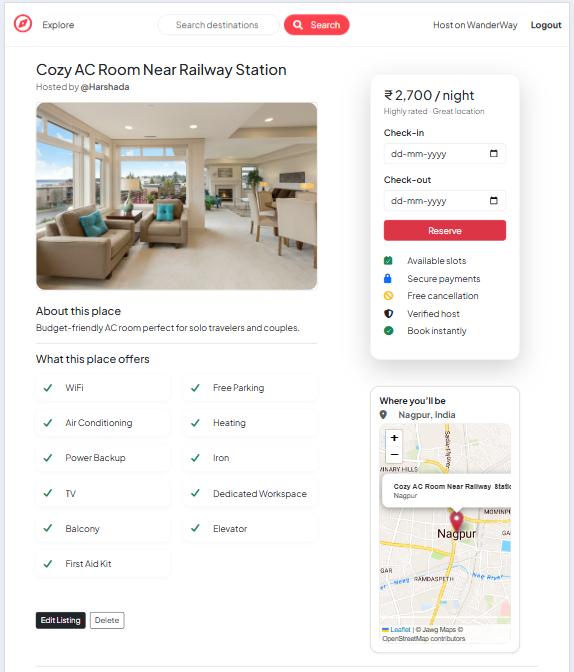
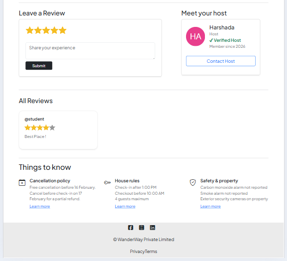
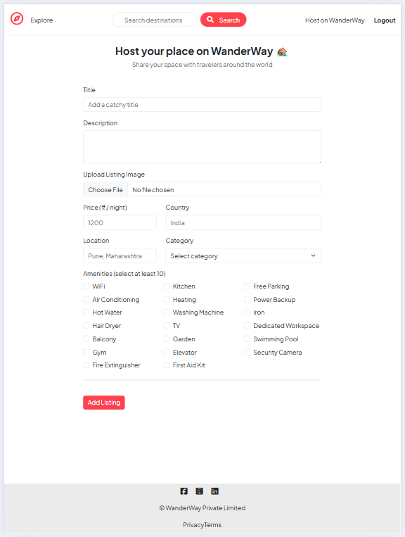
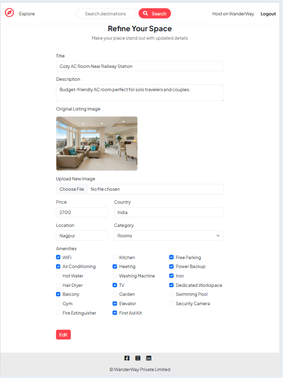
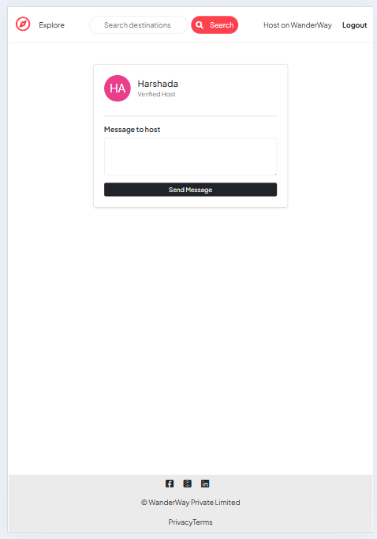

 # WanderWay 
WanderWay is a full-stack web application that allows users to explore, list, and review unique stays using a clean and responsive interface.

## Live Demo
🔗 https://wanderway-a753.onrender.com
⚠️ Note: The application is deployed on a free Render instance, so the first load may take 1–2 minutes due to server cold start.

## About the Project
WanderWay is a full-stack accommodation listing platform developed to gain hands-on experience with real-world web development.
The project focuses on backend architecture, authentication, database relationships, cloud-based image storage, and deployment, while also maintaining a responsive and user-friendly UI.

## Features
- User authentication and authorization
- Create, edit, and delete property listings
- Upload and manage images using Cloudinary
- Review and rating system for listings
- Search and category-based filtering
- Responsive design for mobile, tablet, and desktop
- Server-side validation using Joi
- RESTful routing and MVC architecture

## Tech Stack
### Frontend
- EJS (Embedded JavaScript Templates)
- Bootstrap 5
- HTML, CSS, JavaScript

### Backend
- Node.js
- Express.js

### Database
- MongoDB
- Mongoose

### Cloud & Tools
- Cloudinary (Image Storage)
- Render (Deployment)
- Joi (Validation)
- dotenv (Environment Variables)

## Screenshots
Screenshots are captured in tablet/mobile view to highlight the responsive design.
### 🏠 Home Page

  

### 🔐 Authentication
#### Login Page

#### Sign Up Page

### 📋 Listings
#### Listing Details – View 1

#### Listing Details – View 2

### ✍️ Manage Listings
#### Create New Listing

#### Edit Existing Listing

### 💬 User Interaction
#### Message Host

